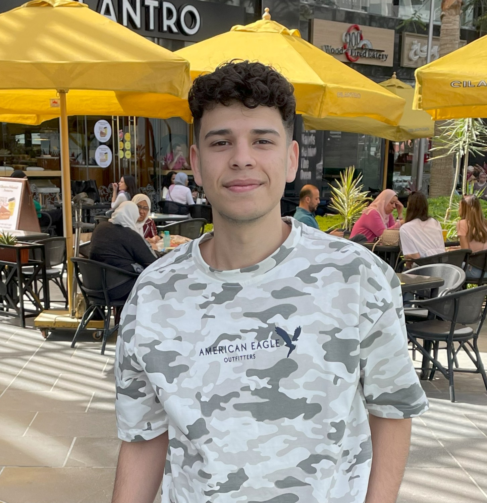

# Basel Elsrogy

## Summary
I'm Basel, a back-end developer & student aiming to become full-stack. Passionate about learning & growth.

---

## Education
- Completed General Secondary Education (Thanaweya Amma) - Year: [2020]
- Completed a two-year Technical Commercial Institute program
- Currently pursuing a Bachelor's degree in Commerce at Benha University
- Expected graduation year: 2026

---

## Work Experience

### Men's Clothing Store
- Worked for one year as a Sales Assistant
- Responsible for assisting customers, organizing merchandise, and managing daily sales

### Men's Shoes and Bags Store
- Worked for one year as a Sales Assistant
- Focused on customer service, inventory organization, and product promotion
- Gained two years of hands-on experience in retail sales with strong skills in communication, customer service, product display, and closing sales.

---

## Skills

### Programming & Development:
- Introduction to Back-End Development
- Python (Programming Language)
- Object-Oriented Programming (OOP)

### Web Development:
- Django Web Framework
- Django REST Framework
- HTML

### Databases & APIs:
- Databases
- Introduction to Databases for Back-End Development
- APIs

### Version Control & Problem Solving:
- Version Control
- Problem Solving

### Soft Skills:
- Communication

---

## Certifications
- [Introduction to Back-End Development](https://coursera.org/share/5eef58cd8e2880e233fea0ad9e2a3c87)
- [Programming in Python](https://coursera.org/share/2299e08fb3d5e8d51339f20f654088da)
- [Version Control](https://coursera.org/share/8e1de24ed553e4480c28434da0eef494)
- [Introduction to Databases for Back-End Development](https://coursera.org/share/7a640c2f14c84e930294429a0ce1f054)
- [Django Web Framework](https://coursera.org/share/cf0b0755e5ef9206e27af4ff6c5b11e9)
- [APIs](https://coursera.org/share/b5f6c1a92579910038c2556379a80e81)

---

## Contact Me
- [LinkedIn](www.linkedin.com/in/basel-elsrogy-929487349)
- [GitHub](https://github.com/baselelsrogy)
- [Instagram](https://www.instagram.com/basel__elsrogy/)

---

© Basel Elsrogy. All rights reserved.

# Demo
(https://baselelsrogy.github.io/Portfolio/)
